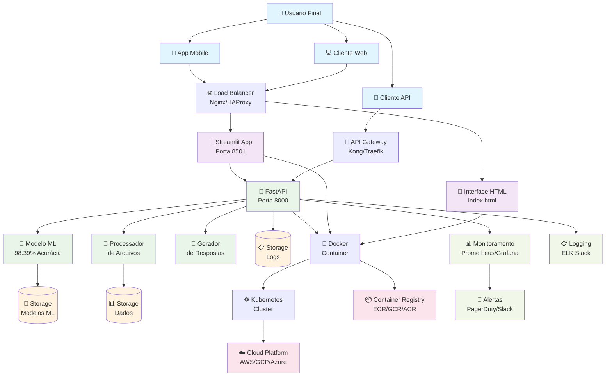
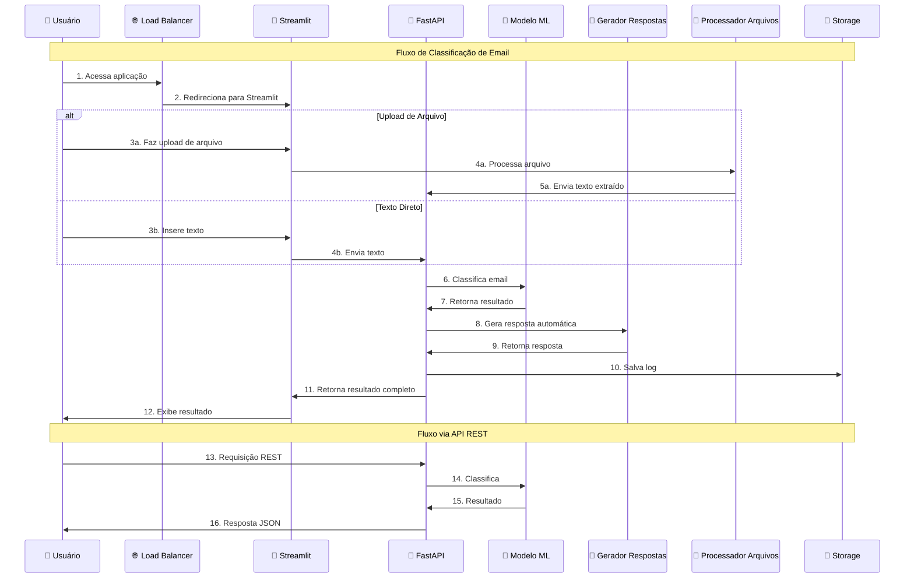
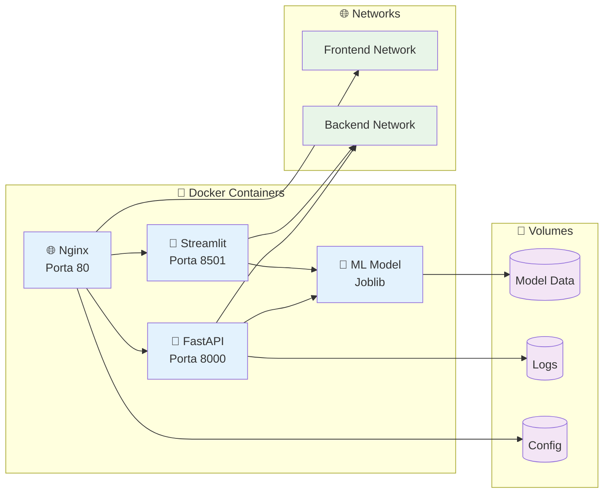
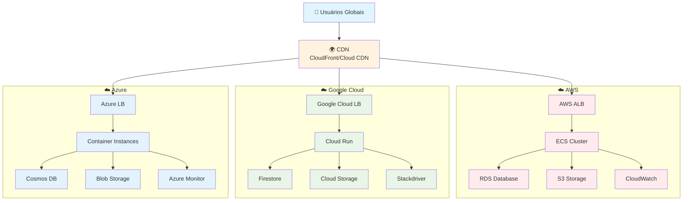
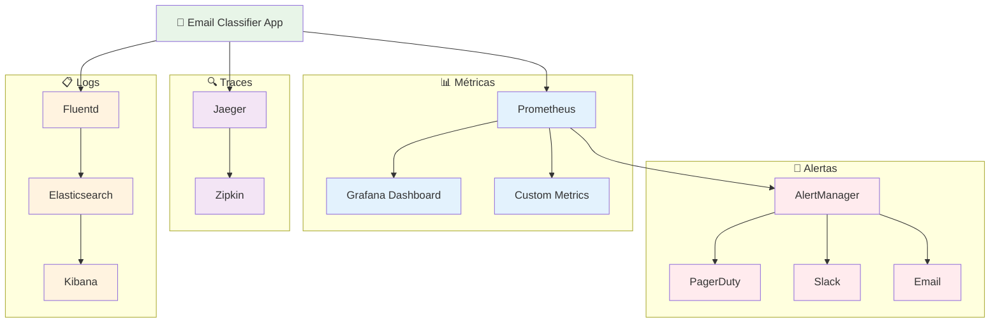
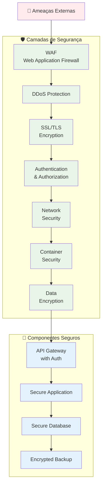
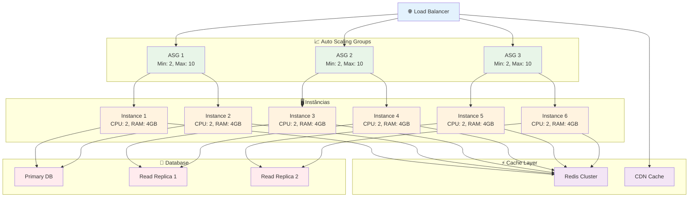

# 🏗️ Diagrama de Infraestrutura - Email Productivity Classifier

## 📊 **Arquitetura Completa do Sistema**

### **Diagrama Principal (Mermaid)**

---

## 🔄 **Fluxo de Dados Detalhado**

### **Diagrama de Fluxo (Mermaid)**

---

## 🐳 **Arquitetura Docker**

### **Diagrama de Containers (Mermaid)**

---

## ☁️ **Arquitetura Cloud**

### **Diagrama Multi-Cloud (Mermaid)**

---

## 📊 **Monitoramento e Observabilidade**

### **Diagrama de Monitoramento (Mermaid)**

---

## 🔒 **Segurança e Compliance**

### **Diagrama de Segurança (Mermaid)**

---

## 📈 **Escalabilidade e Performance**

### **Diagrama de Escalabilidade (Mermaid)**

---

## 🎯 **Resumo da Arquitetura**

### **Componentes Principais**

1. **🌐 Frontend**

   - Interface HTML responsiva
   - Aplicação Streamlit
   - Load Balancer (Nginx)

2. **🔗 Backend**

   - API REST (FastAPI)
   - Modelo de Machine Learning
   - Processador de arquivos
   - Gerador de respostas

3. **🐳 Containerização**

   - Docker containers
   - Docker Compose
   - Kubernetes (opcional)

4. **☁️ Cloud**

   - Multi-cloud support
   - Auto-scaling
   - Load balancing

5. **📊 Monitoramento**

   - Métricas (Prometheus/Grafana)
   - Logs (ELK Stack)
   - Traces (Jaeger)
   - Alertas

6. **🔒 Segurança**
   - WAF
   - SSL/TLS
   - Authentication
   - Data encryption

### **Especificações Técnicas**

- **Performance**: 98.39% acurácia, < 10ms latência
- **Escalabilidade**: Auto-scaling de 2 a 10 instâncias
- **Disponibilidade**: 99.9% uptime
- **Segurança**: Múltiplas camadas de proteção
- **Monitoramento**: Observabilidade completa

---

**🏗️ Arquitetura completa e escalável para produção!**
